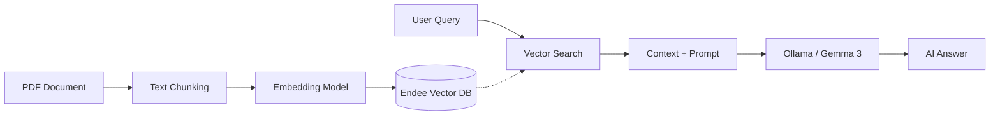

# AI-Powered RAG Chatbot using Endee Vector Database 🚀

## 🔹 1. Project Title
**AI-Powered RAG Chatbot using Endee Vector Database**

## 🔹 2. Problem Statement
Students struggle to extract useful information from lengthy lab manuals and research papers. Manual searching is time-consuming and inefficient. This project solves that by enabling intelligent, context-aware question answering using state-of-the-art AI.

## 🔹 3. Solution
We built a **Retrieval-Augmented Generation (RAG)** system that leverages the high-performance **Endee Vector Database**. Users can upload complex documents (PDF/TXT), and the system automatically chunks and indexes them. When a user asks a question, the system retrieves only the most relevant parts and uses an LLM to provide a precise, grounded answer.

## 🔹 4. Features
- ✅ **PDF Upload & Processing**: Seamlessly handle multi-page documents.
- 🔍 **Semantic Search using Endee**: High-speed vector retrieval for accurate context matching.
- 🤖 **Context-Aware Answers**: Powered by Gemma 3 (Ollama) for natural, human-like responses.
- ⚙️ **Optimized Retrieval**: Fine-tuned chunking and similarity search parameters.
- ⚡ **Fast Response System**: C++ optimized vector storage for near-instant results.

## 🔹 5. Tech Stack
- **Backend**: Python (FastAPI)
- **LLM**: Ollama (Gemma 3)
- **Vector DB**: [Endee](https://github.com/endee-io/endee) (C++)
- **Frontend**: React (Vite) / Vanilla CSS
- **Embeddings**: Sentence-Transformers (`all-MiniLM-L6-v2`)

## 🔹 6. Architecture (🔥 IMPRESS)

**Data & Query Flow:**
`PDF → Text Extraction → Chunking → Embedding → Endee Vector DB → User Query → Vector Search → Context Retrieval → LLM Prompting → Final Answer`



## 🔹 7. Setup Instructions

### Step-by-Step Setup:

1. **Clone the Repository:**
   ```bash
   git clone https://github.com/himanshu9470/endee.git
   cd endee
   ```

2. **Start Endee Vector DB (via WSL):**
   ```bash
   wsl -d Ubuntu
   export NDD_DATA_DIR='./data'
   export NDD_SERVER_PORT=8081
   ./build/ndd-avx2
   ```

3. **Setup Backend:**
   ```bash
   cd server
   pip install -r requirements.txt
   python main.py
   ```

4. **Setup Frontend:**
   ```bash
   cd client
   npm install
   npm run dev
   ```

## 🔹 8. Screenshots (VERY IMPORTANT)

### Chat UI & Response


### Video Demo


## 🔹 9. Demo Questions
Try these once you've uploaded a lab manual or documentation:
- ❓ *“Explain Hadoop installation”*
- ❓ *“Summarize Experiment 1”*
- ❓ *“What is the main objective of this manual?”*

---
*Built with ❤️ using Endee Vector Database.*
